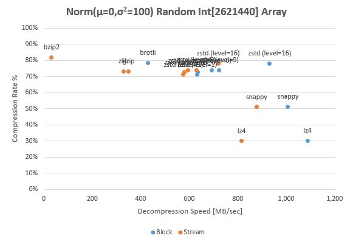
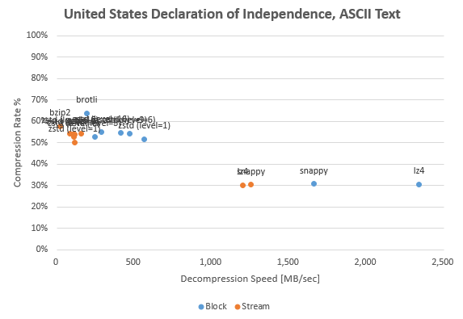

# JavaVM Compression Libraries Benchmark &amp; Comparison

The purpose of this repository is to decide a compression algorithm suitable for the data characteristics and performance of interest.

Compression algorithms that be able to used with JavaVM include those that give priority to compression ratio, those that priority to speed, others that are already obsolete. Generally, modern algorithm implementations use JNI. They are faster and higher compression ratios than Java standard GZIP (although, portability and stability are reduced).

## Benchmark Results

* [2018/03/22: Windows 10 (Core i7-7700)](benchmark/amd64_windows10_20180322.md)

In this benchmark, the API that compresses from `byte[]` to `byte[]` and the API that uses `InputStream`/`OutputStream` are distinguished by **block** and **stream** respectively.

The **java:*uncompress*** doesn't compress or expand binary, only copy between buffer and buffer with `System.arraycopy()`. This is logically the fastest algorithm running on its JavaVM, so this can be considered as pure overhead. The implementation that using JNI can be faster than this.

The **java:zlib** (deflate) and **java:gzip** are well-known Java standard compression APIs.

The Brotle occurs `UnsatisfiedLinkError` on Windows, so I skipped it.
The ZStandard implementation of Apache Commons Compress depends on `luben/zstd-jni`. So, this benchmark uses only `zstd-jni`.

### Norm(μ=0,σ<sup>2</sup>=100) Random `Int[]`



This benchmark fills an 10MB `Int[]` (that is, 2.6M elements) with Normal (Gaussian) random numbers with average μ=0, variance σ<sup>2</sup>=100, and convert it into a byte array with Big Endianness.

This means that 68% of all `Int` elements are included in range of ±10, and 95% of them are included in the range of ±20. In other words, most `Int`s are within 1 byte, so most of the bytes are `0x00` or `0xFF`.

### US-ASCII Text Compression



### UTF-8 Text Compression


### Other Benchmarks

## How to Try Your Benchmark

```
$ git clone https://github.com/torao/benchmark.compression.git
$ cd benchmark.compression
$ sbt run
```

Please edit `machine-info.xml` to suit your platform. The information such as CPU brand contained in this file is finally embedded in the benchmark report.

In case you add a benchmark of new binary pattern you wish, add data generation and additional information to [Benchmark.scala](/torao/benchmark.compression/blob/master/src/main/scala/at/hazm/benchmark/compression/Benchmark.scala) and list it in Main.scala.

### Recognized Issues

In **Snappy**, Apache Commons Compress and xerial snappy-java seems to compete under native library. When using the xerial one after benchmark of Apache's, the JavaVM process abnormally aborted due to an access violation, unexpected buffer corruption, or array length `buffer.length` returns a negative value and so on.
